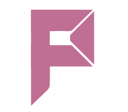

# [Programming Challenges Website](https://prograchallenges.com) Official Code Repository
[Prograchallenges.com](https://prograchallenges.com) is an open source project made for the Telegram group of [Programming Challenges](https://telegram.me/prograchallenges) , This website will always stay free. It is supposed to help programmers enhance their skills and non-programmers become one!
 

# Our Goal
Our Goal is to make a world-class free for all platform for people to learn coding and existing coders to enhance their skills, The v0 of prograchallenges has programming challenges which people can attempt. But our mission is much bigger, we plan to add these features in our upcoming releases: 

1. Online Code Editor For Solving Problems
2. Point System With Leaderboard
3. User Dashboard
4. Free coding courses

Prograchallenges will never stop, More features will come on the way
 

# Contribute
You can join the [telegram group](https://https://t.me/joinchat/2nmp7Kiyrq4yNjJi) for contribution, there you will find very friendly people who can help you out 

The technologies we usw are as follows - 
1. Vue.Js cli
2. Vuex
3. Vue router 
4. Firebase

You can check our code repo to get an idea of the structure,
Also see [CONTRIBUTING.md](https://github.com/Talentrator/Prograchallenges.com/blob/master/CONTRIBUTING.md)
 

# Our Sponsor
[Prograchallenges.com](https://prograchallenges.com) is thankful to [Talentrator](https://talentrator.com/) who are funding this project, 
We enable companies in the Nordic to supercharge their growth by securely hiring the best international software developers. We strongly believe there are many talented developers around the world, eager to work on something meaningful but can't find the right opportunities and have few ways of qualifying themselves. We pledge to find them, test them and allow them to accelerate their careers by working remotely at Nordic software companies. 
For more information, contact [Calle Unnérus](https://telegram.me/calle978) from Talentrator.

